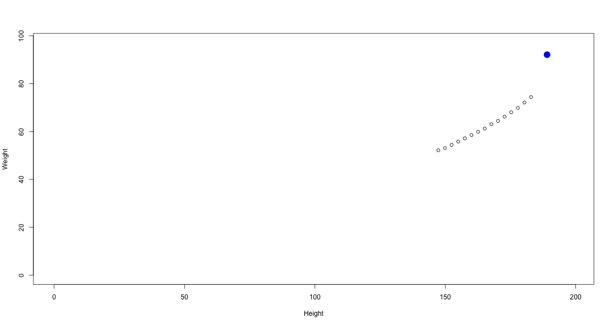

Compare yourself to the average woman of 1975
========================================================
date: February 03 2016
transition: rotate

<small>
Presentation on final project for the Developing Data Products course of the Coursera Data Science Specialization.
</small>

Goal
========================================================

Create a tool that allows anyone to compare their height and weight to the averages for women aged 30-39 in 1975.

Find out if:
- you weigh more or less given your height
- you lie outside typical height and weight ranges

The R code for the presentation can be found on github:
https://github.com/daviddamen/CourseraDataProduct

Dataset
========================================================

- The 'women' dataset from the R datasets package
- 15 observations on height and weight
- Women aged 30 to 39
- Source: The World Almanac and Book of Facts, 1975
- Original source: American Society of Actuaries Build and Blood Pressure Study

Data Cleaning
========================================================
The data was transformed to the metric system:
- inches to centimeter
- pounds to kilograms

```r
womenDF <- women
womenDF$height <- womenDF$height * 2.54
womenDF$weight <- womenDF$weight * 0.453592
summary(womenDF)
```

```
     height          weight     
 Min.   :147.3   Min.   :52.16  
 1st Qu.:156.2   1st Qu.:56.47  
 Median :165.1   Median :61.23  
 Mean   :165.1   Mean   :62.02  
 3rd Qu.:174.0   3rd Qu.:67.13  
 Max.   :182.9   Max.   :74.39  
```

Example
========================================================
The data product lets you enter your height and weight and produces a plot that visualizes how you compare. For instance with my data (the blue dot):

